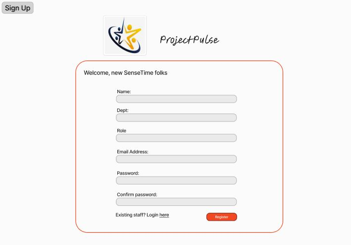
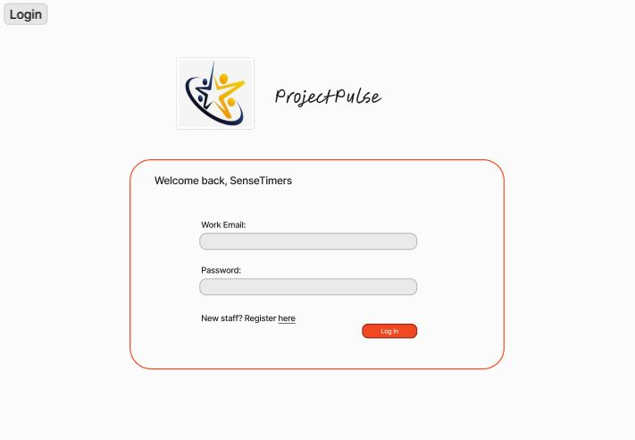
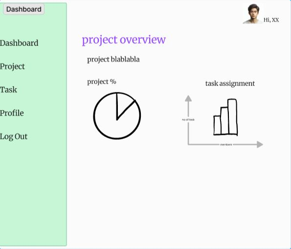
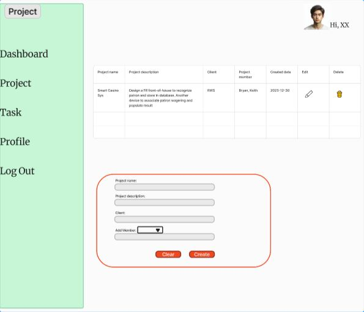
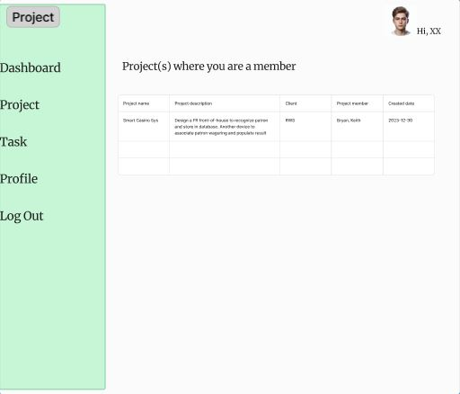
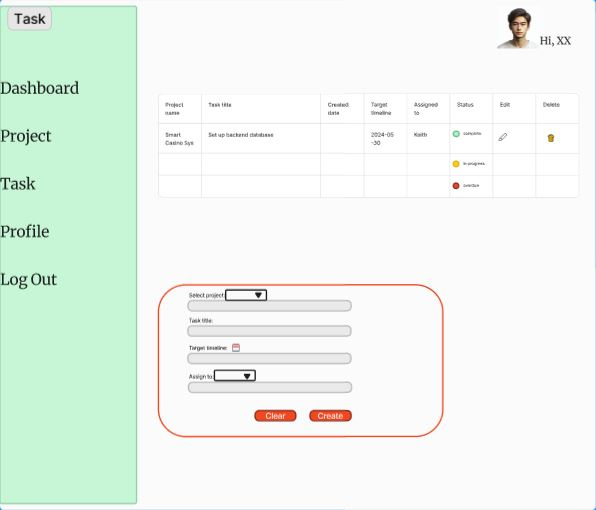
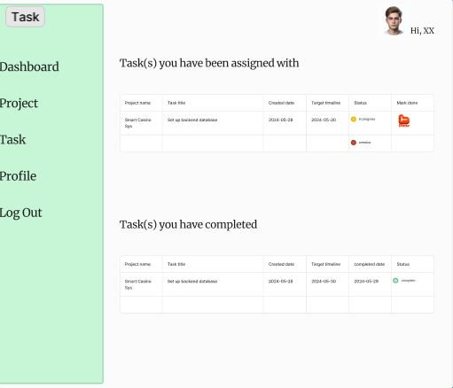
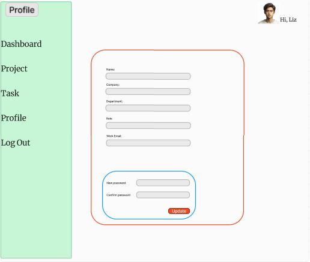

# Develop a Project Management App Lite

## App Description

#### Title: _ProjectPulse - ace your company's tech project mangement_

#### Background 
When I worked as a junior devops with my former employer, I noticed that every project was usually documented in word, ppt or excel format, stored in a cloud platform like OneDrive. When needed, project lead and team-members should access the respective documents to make any updates.
This process of project management could be quite inconvenient sometimes when team-members wished to know the detail of the task they have been assigned to, or for the project manager to look at the overall task/project completion status and track the project timeline.
Thus, I have come up with the idea of creating a workspace where project manager/team lead can handle project task assignment more efficiently, and the team-members are able to keep track and update their task status real-time, avoiding overdue tasks. In addition, they should be able to visualize the project progress statistically.

#### User Story
As a project manager/scrum-master/dev lead, when I browse the app, I would want to:
<ul>
<li>have a quick look on the project(s) that the team has on-hand.</li>
<li>be able to visualize the progress of the project(s) statistically.</li>
<li>know the task contribution of the team members.</li>
<li>track each task accomplishment status, look out for overdue tasks.</li>
<li>create and assign project(s) and tasks to specific members.</li>
</ul>
As a project contributor/member, when I browse the app, I would want to:
<ul>
<li>catch a glimpse of the overall stats of the project(s) that I am involved in.</li>
<li>see all the tasks that the team lead has assigned to me, with the preferable timeline.</li>
<li>be able to update the task completion status whenever I am done with it, and the status can be updated real-time to the project lead’s dashboard</li>
</ul>

## App UI Design
Before getting into actual codes, I have crafted out some layouts of the web interface for which I think the app should look like ideally. The layout would have varied as moving down the development path.

<kbd>Sign Up/Login</kbd>

<kbd>Dashboard</kbd>

<kbd>Project</kbd>

<kbd>Task</kbd>

<kbd>Profile</kbd>

## Technologies & Tools Used
For minimalist design 
- React JS (Vite)
- Express with Node.js
- PostgreSQL
- Tailwind (CSS)
- Jotai 
- Chart.js (charts library)
- Bruno (API endpoint tester)
- Git & GitHub
- Render (cloud deployment)

## Getting Started
### Deployment
The app has been deployed on Render. Click [Here](https://projectpulse-mc3d.onrender.com) to get started.

### Project Planning Board
Visit my [Trello](https://trello.com/b/TDdRuDrY/projectpulse) to see the project planning details, wireframe and other components.

## Challenges
As this is the first time I am using postgres database connected to an Express server, I started picking up the SQL through online tutorials and practice on mock tables. I experienced difficulties like db connections, joining tables on a 1-M, M-N relationships etc. These took me a while to figure out and get use to the syntax and everything. The biggest challenge here is to process the data coming from client side correctly before sending the query to the database, as the data format difference could be a critical problem if not handled properly. Also, I have to make sure only the desired backend data is rendered to the frontend for each request, be it for the purpose of validation, or UI display. Unlike MongoDB which has flexible data modelling through Mongoose, I find it almost impractical to apply the same type of model in postgres especially for the data referencing. There is definitely walkaround but also with considerable trade-off. Hence, a lot of post-query data-processing works are required before I can display the data in the way I want them to be. Most of my planned features are implemented according to the wireframe, however, I still struggle in the brainstorm to get the ideas on how I can implement CRUD operation on projects, knowing that it may require disassociation and reassociation of datasets, which could be tough in my case considering the amount of time I had in this project. 

## Key Learnings
<ol>
<li>Plan the data models carefully before inserting all the data in. I had experienced a circumstance where I had destroy and re-create the table because I did not specify the data-type and requirement correctly and I only came to realize this in the midst of development, painstakingly.</li>
<li>Double check the API routes, you can copy and paste the path when they are indeed the same. I used to type everything manually and that was when mistakes could occur unknowingly. You will likely spend more time troubleshooting than checking while you are typing.</li>
<li>Apart from all the painful mistakes, I have learnt utilizing powerful state management libraries like Jotai, for the convenience of preventing code movement which can cause errors, although it also comes with trade-off since it relies on other states.</li>
<li>State-of-the-art library like Chart.js is very useful in visualizing statistical data if you know how to pre-process the data before rendering it.</li>
<li>Learned to use class-based CSS library like Tailwind. Although in my humble opinion, MUI is better for those just dive in to CSS</li>
</ol>

## Moving Forward - The Future Enhancements
- My biggest regret in this project, which resides in my icebox, that is, the CRUD of projects.
- One in my long-lasting wishlist, which is to integrate SMTP that helps in sending a "forget password" email.
- Implement a Jira-like issue tracking system.

